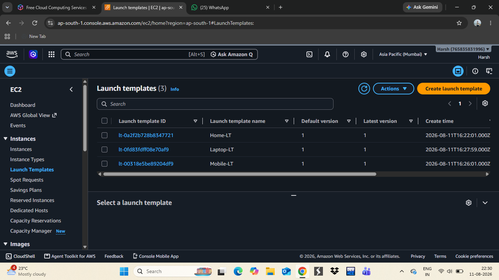
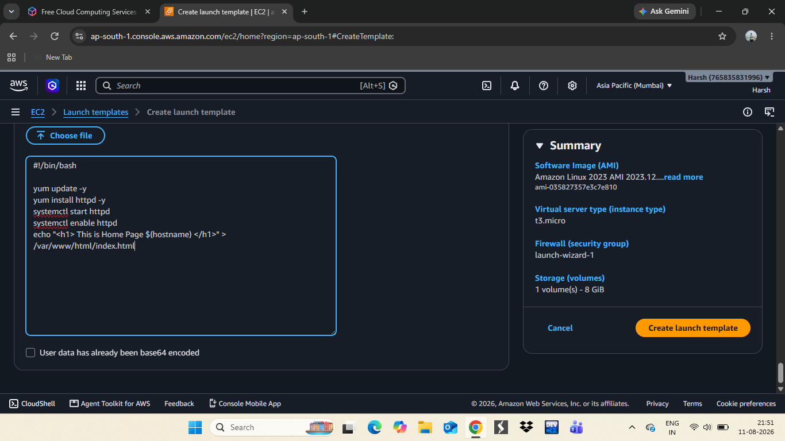
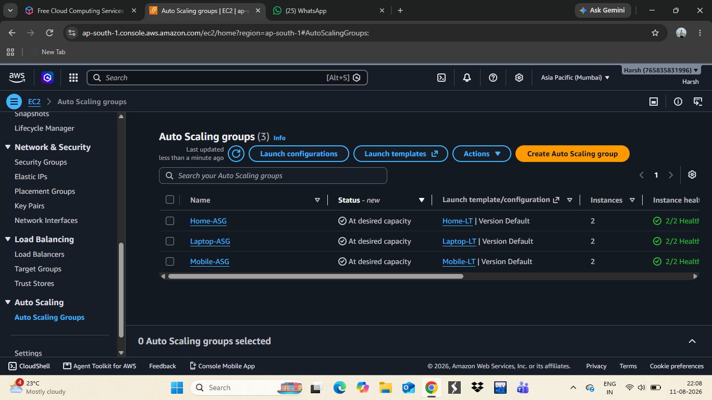
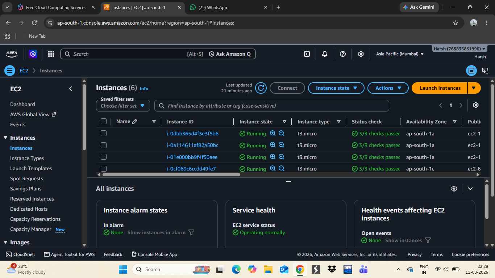
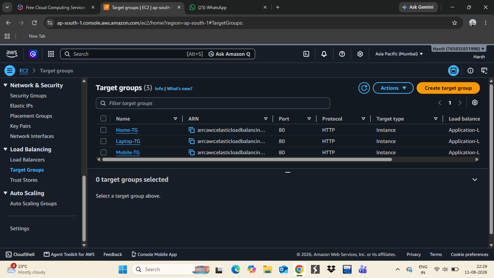
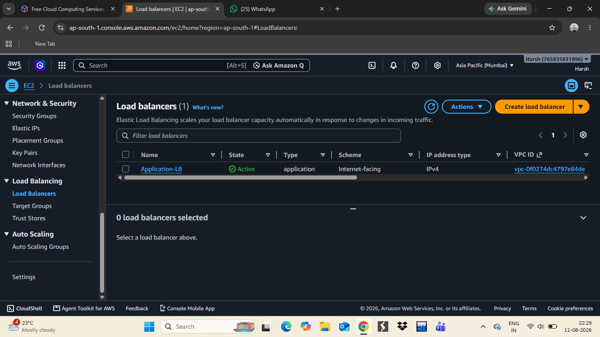
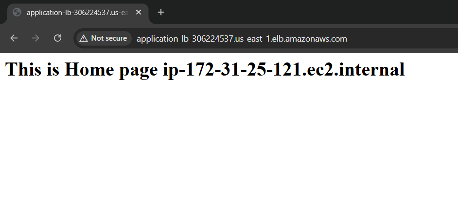
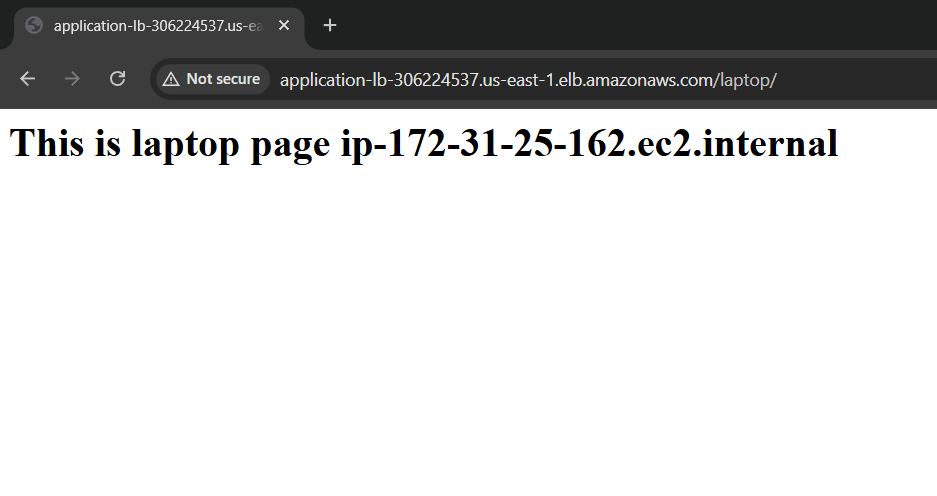

# AWS Auto Scaling Group with Elastic Load Balancer

This project demonstrates a **highly available and auto-scaling web infrastructure** on AWS using **EC2 Launch Templates**, **Auto Scaling Groups (ASG)**, **Target Groups**, and an **Application Load Balancer (ALB)**.

## 🏗️ Architecture Overview

Three independent applications (**Home**, **Laptop**, **Mobile**) were each deployed with their own:
- Launch Template (defines AMI, instance type, and bootstrap script)
- Auto Scaling Group (maintains desired instance count and health)
- Target Group (routes traffic to healthy instances)

All three Target Groups are connected to a single **Application Load Balancer**, which distributes incoming traffic across the instances.

## ⚙️ Steps Performed

### 1. Created Launch Templates
Launch templates were created for each application with a user-data bootstrap script that installs and starts Apache (`httpd`) and serves a custom HTML page identifying the instance.

```bash
#!/bin/bash
yum update -y
yum install httpd -y
systemctl start httpd
systemctl enable httpd
echo "<h1> This is Home Page $(hostname) </h1>" > /var/www/html/index.html
```



Three launch templates were created — `Home-LT`, `Laptop-LT`, and `Mobile-LT`:



### 2. Created Auto Scaling Groups
Each launch template was attached to its own Auto Scaling Group (`Home-ASG`, `Laptop-ASG`, `Mobile-ASG`), which automatically launches and maintains EC2 instances at the desired capacity.



### 3. Verified EC2 Instances
All EC2 instances launched by the Auto Scaling Groups were running and passed status checks.



### 4. Created Target Groups
A Target Group was created for each application (`Home-TG`, `Laptop-TG`, `Mobile-TG`) to route HTTP traffic to the healthy instances.



### 5. Created Application Load Balancer
An Application Load Balancer (`Application-LB`) was created as an internet-facing load balancer to distribute traffic across the target groups.




## ✅ Result

- Fully automated instance provisioning via Launch Templates
- Self-healing infrastructure via Auto Scaling Groups
- Traffic distribution and health checks via Target Groups
- Single entry point for users via the Application Load Balancer

## 🛠️ AWS Services Used

| Service | Purpose |
|---|---|
| EC2 | Virtual servers hosting the web application |
| Launch Templates | Reusable instance configuration + bootstrap script |
| Auto Scaling Groups | Automatic scaling and self-healing of instances |
| Target Groups | Health checks and traffic routing |
| Application Load Balancer | Distributes incoming traffic across instances |


**Home Page** — `application-lb-306224537.us-east-1.elb.amazonaws.com`



**Laptop Page** — `application-lb-306224537.us-east-1.elb.amazonaws.com/laptop/`



**Mobile Page** — `application-lb-306224537.us-east-1.elb.amazonaws.com/mobile/`


## ✅ Result

- Fully automated instance provisioning via Launch Templates
- Self-healing infrastructure via Auto Scaling Groups
- Traffic distribution and health checks via Target Groups
- Single entry point for users via the Application Load Balancer

## 🛠️ AWS Services Used

| Service | Purpose |
|---|---|
| EC2 | Virtual servers hosting the web application |
| Launch Templates | Reusable instance configuration + bootstrap script |
| Auto Scaling Groups | Automatic scaling and self-healing of instances |
| Target Groups | Health checks and traffic routing |
| Application Load Balancer | Distributes incoming traffic across instances |

## 📂 Project Structure

```
project/
├── README.md
└── images/
    ├── launch-template-userdata.png
    ├── launch-templates.png
    ├── auto-scaling-groups.png
    ├── ec2-instances.png
    ├── target-groups.png
    ├── load-balancer.png
    ├── auto-scaling-groups-scaled.png
    ├── home-page-output.png
    ├── laptop-page-output.png
    └── mobile-page-output.png
```
